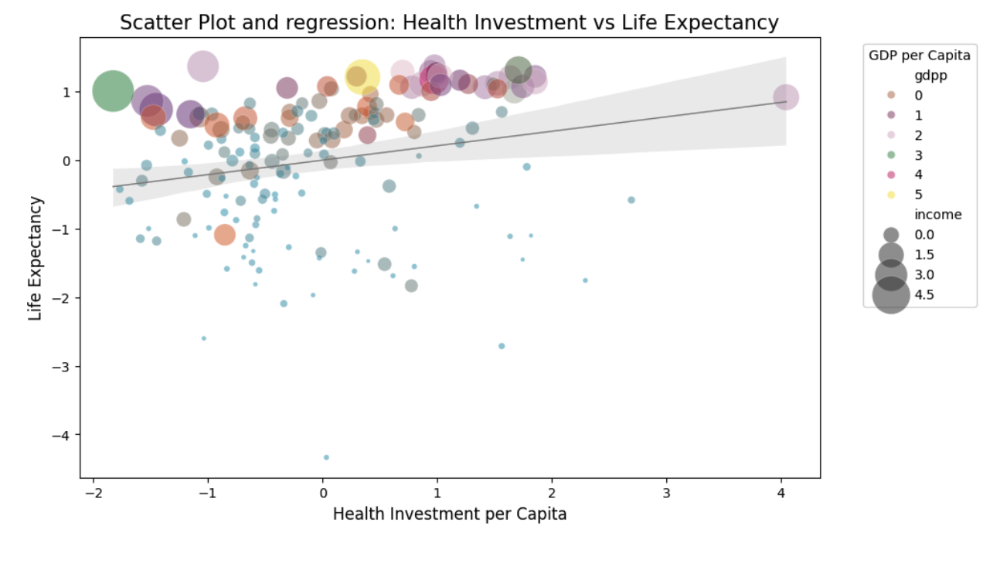
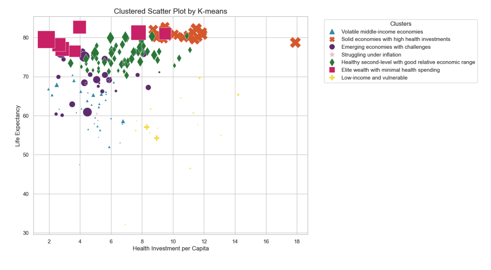
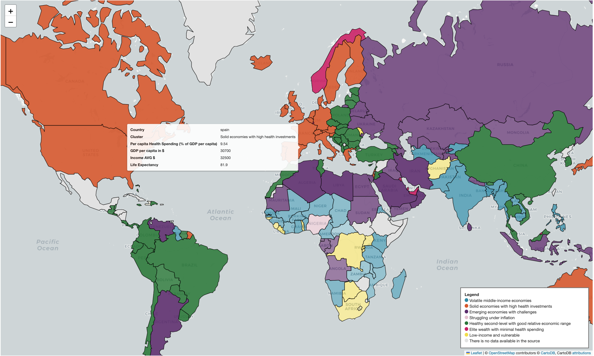

# Clustering Countries by Socioeconomic Indicators Using K-means

## Summary

This project focuses on clustering countries based on a range of socioeconomic indicators to uncover meaningful patterns in life expectancy and economic factors. Utilising a dataset encompassing information from 167 countries, machine learning techniques were employed to identify similarities in areas such as health expenditure, GDP, and life expectancy. The goal is to develop a deeper understanding of how these socioeconomic indicators are interconnected and influence the quality of life across nations.

## Key Techniques & Skills

**Data Preprocessing:** Efficient data manipulation was achieved using Pandas, including handling missing values and preparing the dataset for analysis. StandardScaler from Scikit-Learn was utilised to normalise numerical data, ensuring features were on the same scale for unbiased clustering.

**Exploratory Data Analysis (EDA):** EDA was performed with Matplotlib and Seaborn to visualise and comprehend the distribution of key features such as child mortality, income, and health expenditure. These visual insights laid the groundwork for the clustering process.

**K-means Clustering:** The K-means algorithm from Scikit-Learn was applied to group countries based on their socioeconomic characteristics. To determine the optimal number of clusters, both the elbow method and silhouette analysis were used, which ensured meaningful segmentation.

**Data Visualisation:** Geopandas and Folium were employed to create interactive maps for an intuitive understanding of the clusters. These tools enabled a geographical representation of the data, facilitating the identification of spatial patterns among countries. Additionally, Matplotlib was used to visualise relationships between features.

## Technical Keywords

- **Data Analysis:** Pandas, NumPy
- **Normalization:** Scikit-Learn, StandardScaler
- **Clustering:** K-means, elbow method, silhouette score
- **Visualisation:** Geopandas, Folium, Matplotlib, Seaborn
- **Machine Learning:** Unsupervised learning, feature scaling
- **ETL:** Data extraction, transformation, loading
- **Statistics:** Descriptive statistics
- **Kaggle:** Competitions
- **VSCode & GitHub:** Version control

## Results & Insights

The analysis segmented countries into distinctive clusters based on key socioeconomic indicators. Clear patterns emerged from these clusters: for example, high-income countries generally exhibited higher life expectancy, whereas lower-income countries tended to have less health expenditure and lower life expectancy. These insights are invaluable for policymakers and economists aiming to address disparities and prioritise interventions.

## Soft Skills

- **Problem-Solving:** Demonstrated ability to identify and analyse key factors affecting life expectancy using machine learning techniques.
- **Communication:** Effectively conveyed findings through visual storytelling, including the usage of geographic maps and data visualisations, to make complex data more comprehensible.
- **Attention to Detail:** Maintained data accuracy during the preprocessing phase and validated the quality of the clustering process.

## Value Proposition

This project exemplifies a solid grasp of data analysis, clustering techniques, and data visualisation to derive actionable insights from real-world datasets. I am ready to apply these skills in data analytics roles, contributing to evidence-based decision-making and supporting strategic initiatives within a collaborative team environment.

# Getting Started

### How to run it:
1. Clone this repository.
2. Ensure the data is available:
    - Place `Country-data.csv` in the `data/` directory if not already present.
    - Install the required packages:

    ```bash
    while read requirement; do conda install -y $requirement; done < conda-requirements.txt
    ```

3. Run the notebook and interact with the map.

### Access the Jupyter Notebook

[Click here to view the notebook](resources/countries-life-expectancy-k-means-clustering.ipynb)

### Some visualisations on the report
#### Showing regression in a scatter plot

We can observe that countries with the highest income tend to have more health investments and better life expectancy. However, there are cases where countries with higher income have less health investment than those with lower income. Similarly, some countries with high income might have poorer life expectancy compared to those with lower income and health investment. It’s somewhat confusing!

#### Unsupervised K7 Clusters scatter plot

Notice the difference in insights. Our clusters simplify global understanding by revealing similarities and differences between countries.

#### Wich and were are those clustered countries?

*Please note, this is a screenshot! For quick interactivity with the map, you can visit my [Kaggle](https://www.kaggle.com/code/josepescrivasavall/k-mean-data-analysis-economic-factors-in-countrie/edit#5.-What/where-are-this-countries?-Mapping-the-life-expectacy-in-world-countries) repository, and, of course, you can download the entire project to run it in your local environment.

### LinkedIn

[Connect with me on LinkedIn](https://www.linkedin.com/in/josepescriva/)

