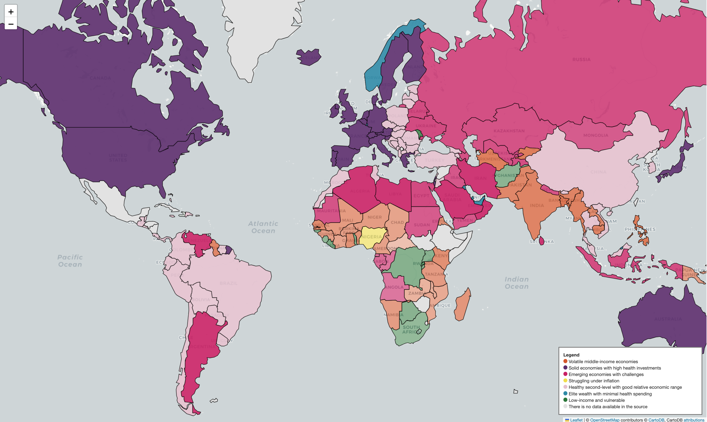

## Getting Started

1. Clone this repository:

2. Make sure the data is available:
- Place `Country-data.csv` in the `data/` directory if not already present.
- Install conda-requirements.txt


```bash
while read requirement; do conda install -y $requirement; done < conda-requirements.txt
```

3. Run the notebook and interact with the map:
## Access the Jupyter Notebook

[Click here to view the notebook](notebooks/countries-life-expectancy-k-means-clustering.ipynb)

## Clustered Countries Map

This is a snapshot!